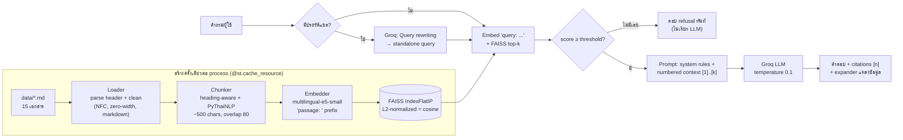

# 🌱 ผู้ช่วยผู้เชี่ยวชาญด้านการเกษตรและโรคพืช (Agriculture & Plant Disease Expert Assistant)

แชตบอต **Retrieval-Augmented Generation (RAG)** ภาษาไทย/อังกฤษ ที่ตอบคำถามเรื่องการปลูกพืชและโรค/แมลงศัตรูพืชในประเทศไทย **โดยอ้างอิงเฉพาะเอกสารในคลังความรู้ (`data/`)** พร้อมแสดงแหล่งที่มาทุกคำตอบ และตอบว่า "ไม่พบข้อมูลในเอกสารที่มี" เมื่อคลังความรู้ไม่มีคำตอบ แทนการเดา

> สร้างด้วย Streamlit · sentence-transformers (`intfloat/multilingual-e5-small`) · FAISS · PyThaiNLP · Groq API

---

## 1. ภาพรวมและแนวคิดของโดเมน (Domain concept)

**ทำไมเลือกการเกษตรและโรคพืช?** ภาคเกษตรเป็นอาชีพหลักของคนไทยจำนวนมาก โรคและแมลงศัตรูพืช (เช่น โรคไหม้ข้าว เพลี้ยกระโดดสีน้ำตาล โรครากเน่าโคนเน่าทุเรียน โรคใบด่างมันสำปะหลัง) ทำให้ผลผลิตเสียหายปีละมาก ข้อมูลที่ถูกต้องมีอยู่ในเอกสารของหน่วยงานรัฐ (กรมการข้าว กรมวิชาการเกษตร กรมส่งเสริมการเกษตร ฯลฯ) แต่กระจัดกระจายและค้นหายาก

**ช่วยใคร?**
- **เกษตรกร**: ถามอาการ/วิธีจัดการโรคเป็นภาษาไทยง่าย ๆ ได้ทันที
- **นักเรียน/นักศึกษาเกษตร**: ทบทวนความรู้พร้อมแหล่งอ้างอิง
- **ผู้ปลูกพืชในบ้าน (home gardeners)**: วินิจฉัยอาการเบื้องต้นและแนวทาง IPM

**ทำไมต้อง RAG?** คำแนะนำเรื่องสารเคมีเกษตรต้องถูกต้อง หาก LLM "แต่ง" ชื่อสารหรืออัตราการใช้ขึ้นมาเองอาจเป็นอันตราย RAG บังคับให้ตอบจากเอกสารที่ตรวจสอบได้ พร้อมอ้างอิง `[1]`, `[2]` และปฏิเสธเมื่อไม่มีข้อมูล

## 2. ฟีเจอร์ (Features)

- 💬 แชตต่อเนื่องหลายรอบ (multi-turn) ด้วย `st.chat_message` / `st.chat_input` / `st.session_state`
- 🇹🇭🇬🇧 ถาม-ตอบได้ทั้งภาษาไทยและอังกฤษ (ตอบเป็นภาษาเดียวกับคำถาม แม้เอกสารจะเป็นอีกภาษา — cross-lingual retrieval)
- 📚 **ทุกคำตอบแสดงแหล่งข้อมูล**: expander ใต้คำตอบแสดงชื่อเอกสาร หัวข้อ (section) คะแนนความคล้าย (similarity) ไฟล์ ลิงก์แหล่งที่มา และเนื้อหา chunk พร้อมเครื่องหมาย ✅ สำหรับ chunk ที่ถูกอ้างอิงในคำตอบ
- 🔁 **Follow-up query rewriting**: เขียนคำถามต่อเนื่อง เช่น "แล้วโรคนี้ป้องกันยังไง" ใหม่เป็นคำค้นที่สมบูรณ์ ("วิธีป้องกันโรคไหม้ข้าว") ก่อนค้นหา
- 🚫 **Refusal**: ตอบ "ไม่พบข้อมูลในเอกสารที่มี" / "I couldn't find this in the available documents." เมื่อไม่มีข้อมูล
- ⚠️ ไม่แต่งชื่อการค้า/อัตราสารเคมี และเพิ่มคำเตือนความปลอดภัยเมื่อพูดถึงสารเคมี
- ⚙️ Sidebar: คำอธิบายแอป, ตัวอย่างคำถาม (คลิกได้), slider top-k, ปุ่มล้างการสนทนา, ข้อจำกัดความรับผิดชอบ
- 🔐 API key อ่านจาก `st.secrets` เท่านั้น (fallback เป็น environment variable สำหรับ local dev) — ไม่มี key ในโค้ด

## 3. สถาปัตยกรรม (Architecture)



โครงสร้างไฟล์:

```
app.py                      # Streamlit UI (entry point)
rag/
  config.py                 # ค่าตั้งค่าทั้งหมด (โมเดล, chunk size, top-k, threshold, refusal)
  textutils.py              # ทำความสะอาดข้อความ, ตรวจภาษา
  loader.py                 # โหลดไฟล์ + parse metadata header
  chunker.py                # แบ่ง chunk แบบ structure-aware + Thai-aware
  index.py                  # embedding + FAISS index + search
  prompts.py                # system prompt, rewrite prompt, จัดรูป context
  llm.py                    # Groq client + จัดการ error เป็นข้อความที่เป็นมิตร
  pipeline.py               # RAGPipeline (ใช้ร่วมกันระหว่าง app.py และ evaluate.py)
data/                       # คลังความรู้ 15 ไฟล์
test_questions.csv          # ชุดทดสอบ 21 คำถาม (UTF-8 BOM)
evaluate.py                 # ประเมินผล → eval_results.csv
tests/                      # pytest (offline, mock LLM) + Streamlit AppTest
docs/screenshot_guide.md    # รายการภาพหน้าจอที่ต้องส่ง
make_screenshot_pdf.py      # รวมภาพหน้าจอ + คำอธิบาย เป็น PDF
.streamlit/config.toml      # theme
.streamlit/secrets.toml.example
```

## 4. Tech stack และเหตุผลในการออกแบบ (Design choices)

| พารามิเตอร์ | ค่า | เหตุผล (one-line justification) |
|---|---|---|
| Embedding model | `intfloat/multilingual-e5-small` (384 มิติ, ~470 MB) | โมเดลเล็กที่รองรับภาษาไทยดีและค้นข้ามภาษา TH↔EN ได้ เหมาะกับ RAM จำกัดของ Streamlit Cloud |
| E5 prefixes | `query: ` / `passage: ` | E5 ถูกฝึกมาให้ใช้ prefix นี้ ช่วยให้ค้นได้แม่นขึ้น |
| Chunk text ที่ embed | `passage: {ชื่อเอกสาร} \| {หัวข้อ}\n{เนื้อหา}` | ใส่บริบทชื่อโรค/หัวข้อให้ทุก chunk เพื่อให้ค้นเจอเอกสารที่ถูกต้อง |
| Chunking | แบ่งตาม `##` ก่อน, รวม `###` ย่อยไว้ด้วยกันพร้อม label | รักษาโครงสร้างเอกสาร (อาการ/สาเหตุ/การป้องกัน) และไม่ให้เกิด chunk เล็กเกินไป |
| Chunk size | เป้าหมาย 500, สูงสุด 600 ตัวอักษร (เฉลี่ยจริง ~346) | 1 chunk ≈ 1 ประเด็นที่สมบูรณ์ ค้นได้แม่นและไม่ยาวเกินไปสำหรับ prompt |
| Overlap | ≤ 80 ตัวอักษร ตัดตามขอบคำ (newmm) | รักษาบริบทข้ามรอยต่อ chunk โดยไม่ตัดคำไทยกลางคำ |
| Thai splitting | `pythainlp.sent_tokenize(engine="whitespace+newline")` → `word_tokenize(engine="newmm")` | ภาษาไทยไม่มีช่องว่างระหว่างคำ จึงต้องใช้ตัวตัดคำไทยเพื่อแบ่งที่ขอบคำ/ประโยค (ไม่ต้องลง dependency เพิ่ม) |
| Vector index | FAISS `IndexFlatIP` + L2-normalized vectors | inner product = cosine similarity, exact search; คลังมี 146 chunks จึงเร็วมาก |
| top-k | 6 (ปรับได้ 1–10 ใน sidebar) | chunk ในเอกสารเดียวกันมีคะแนนใกล้กัน คำถามหลายส่วน (สาเหตุ + อาการ) ต้องใช้ ~6 chunks จึงครอบคลุม |
| Similarity threshold | 0.78 (cosine) | ตัวกรองนอกโดเมนแบบหยาบ: คำถามที่เกี่ยวข้องได้ ≥ 0.79 (แม้ข้ามภาษา) ส่วนคำถามนอกเรื่องได้ ≤ 0.78 (ดูหัวข้อ 9) |
| LLM | Groq `openai/gpt-oss-120b` (เปลี่ยนได้ที่ `rag/config.py` → `GROQ_MODEL` หรือ secret `GROQ_MODEL`) | เร็ว (~1 วินาที), รองรับภาษาไทยดี, เป็น production model ของ Groq |
| Temperature | 0.1 (rewrite = 0.0) | ลดความสร้างสรรค์ ให้ตอบตาม context อย่างคงเส้นคงวา |
| Timeout / retries | 30 วินาที / 2 ครั้ง | กันแอปค้าง และแสดงข้อความ error ที่เป็นมิตรเมื่อล้มเหลว |
| Caching | `@st.cache_resource` สำหรับ embedder + index + Groq client | โหลดโมเดล/สร้าง index ครั้งเดียวต่อ server process ไม่ embed ใหม่ทุก rerun (มี test ยืนยัน) |

> **หมายเหตุเรื่องโมเดล LLM:** โจทย์แนะนำ `llama-3.3-70b-versatile` ซึ่งยังมีในหน้า docs ของ Groq แต่เมื่อทดสอบจริง (ต.ค. 2026) API key ของโปรเจกต์ได้ `404 model_not_found` จึงเปลี่ยนเป็น `openai/gpt-oss-120b` ซึ่งอยู่ในรายการ production models หากบัญชีของคุณใช้ Llama ได้ เปลี่ยนค่าเดียวที่ `GROQ_MODEL` ใน `rag/config.py` หรือเพิ่ม `GROQ_MODEL = "..."` ใน Secrets
>
> **หมายเหตุ macOS:** ใน `rag/index.py` ต้อง import `sentence_transformers` (torch) **ก่อน** `faiss` เพราะทั้งคู่มี OpenMP runtime ของตัวเอง หากสลับลำดับจะ segfault ตอน encode บน macOS

## 5. แหล่งข้อมูล (Data sources)

คลังความรู้มี **15 ไฟล์ รวม ~56,800 ตัวอักษร** (ภาษาไทย 10 ไฟล์ / อังกฤษ 5 ไฟล์) แต่ละไฟล์ขึ้นต้นด้วย metadata header (title, source_name, source_url, date_accessed, language) เนื้อหาเป็น **การสรุปและเรียบเรียงใหม่ (paraphrase)** จากแหล่งข้อมูลด้านล่าง ไม่ได้คัดลอกข้อความยาวมาโดยตรง ข้อมูลสารเคมีเขียนในระดับกลุ่มสาร/สารออกฤทธิ์ และให้ใช้ "ตามอัตราที่ระบุบนฉลาก" ยกเว้นตัวเลขที่ระบุไว้ในเอกสารทางราชการซึ่งอ้างอิงแหล่งที่มาไว้

| ไฟล์ | หัวข้อ | แหล่งที่มา | URL หลัก |
|---|---|---|---|
| `01_rice_blast.md` | โรคไหม้ข้าว | กรมการข้าว (Rice Knowledge Bank); IRRI | [rkb.ricethailand.go.th](https://rkb.ricethailand.go.th/web/content_page.php?code=RKUZ3Y85CVWXMTTXWNLNIZW8MWYCO) · [IRRI](http://www.knowledgebank.irri.org/training/fact-sheets/pest-management/diseases/item/blast-leaf-collar) |
| `02_rice_bacterial_leaf_blight.md` | โรคขอบใบแห้ง | กรมการข้าว; IRRI | [rkb](https://rkb.ricethailand.go.th/web/content_page.php?code=2L33OEI25IVZ1V788VRJ3LP8DH678) · [IRRI](http://www.knowledgebank.irri.org/training/fact-sheets/pest-management/diseases/item/bacterial-blight) |
| `03_rice_brown_planthopper.md` | เพลี้ยกระโดดสีน้ำตาล | กรมการข้าว; IRRI | [rkb](https://rkb.ricethailand.go.th/web/content_page.php?code=IKC4N6RDUNUIBWGU4MR107J9ZQSBW) · [IRRI](http://www.knowledgebank.irri.org/training/fact-sheets/pest-management/insects/item/planthopper) |
| `04_rice_sheath_blight.md` | โรคกาบใบแห้ง | กรมการข้าว; IRRI | [rkb](https://rkb.ricethailand.go.th/web/content_page.php?code=RAOIJBTJGHM7MF6DWLWIPK1XTJ30Y) · [IRRI](http://www.knowledgebank.irri.org/training/fact-sheets/pest-management/diseases/item/sheath-blight) |
| `05_durian_phytophthora.md` | โรครากเน่าโคนเน่าทุเรียน | กรมวิชาการเกษตร; กรมส่งเสริมการเกษตร; กระทรวงเกษตรฯ | [opsmoac.go.th](https://www.opsmoac.go.th/yala-warning-files-432891791796) · [doa.go.th](https://www.doa.go.th/share/attachment.php?aid=2968) |
| `06_durian_fertilizer_water.md` | การจัดการปุ๋ยและน้ำทุเรียน | กรมวิชาการเกษตร | [doa.go.th](https://www.doa.go.th/share/attachment.php?aid=2973) |
| `07_mango_anthracnose_powdery_mildew.md` | แอนแทรคโนส/ราแป้งมะม่วง + การออกดอก/ห่อผล | กรมวิชาการเกษตร; สนง.เกษตรและสหกรณ์จังหวัดชุมพร | [opsmoac.go.th](https://www.opsmoac.go.th/chumphon-warning-files-431891791867) · [doa.go.th](https://doa.go.th/share/attachment.php?aid=2787) |
| `08_cassava_mosaic_mealybug_rootrot.md` | ใบด่าง/เพลี้ยแป้ง/โคนเน่ามันสำปะหลัง | กรมส่งเสริมการเกษตร (เอกสารคำแนะนำ 1/2566) | [mediatank.doae.go.th](https://mediatank.doae.go.th/medias/file_upload/02-2023/3-1759043809349595.pdf) · [doaenews](https://doaenews.doae.go.th/archives/20348) |
| `09_chili_anthracnose.md` (EN) | Chili anthracnose (โรคกุ้งแห้ง) | Pacific Pests, Pathogens & Weeds (ACIAR); กรมส่งเสริมการเกษตร | [lucidcentral.org](https://apps.lucidcentral.org/ppp/text/web_full/entities/capsicum_chilli_anthracnose_177.htm) |
| `10_tomato_bacterial_wilt_virus_whitefly.md` (EN) | Bacterial wilt, TYLCV, whitefly, thrips | Univ. of Arkansas Extension; UF/IFAS; World Vegetable Center; DOA | [uaex.uada.edu](https://www.uaex.uada.edu/yard-garden/plant-health-clinic/disease-notes/posts/disease-note-17.aspx) · [UF/IFAS](https://ask.ifas.ufl.edu/publication/IN1430) |
| `11_ipm_principles.md` (EN) | IPM principles | UC IPM; FAO; IRAC; FRAC | [ipm.ucanr.edu](https://ipm.ucanr.edu/what-is-ipm/) · [FAO](https://www.fao.org/4/ac834e/ac834e04.htm) |
| `12_safe_pesticide_use_phi.md` | ใช้สารเคมีอย่างปลอดภัย, PHI, MRL, GAP | ประกาศกระทรวงเกษตรฯ เรื่องฉลาก พ.ศ. 2538; กรมวิชาการเกษตร; กรมส่งเสริมการเกษตร; Penn State Extension | [doa.go.th (PDF)](https://www.doa.go.th/ard/wp-content/uploads/2024/07/%E0%B8%9B%E0%B8%81.%E0%B8%81%E0%B8%A9-1.-%E0%B8%89%E0%B8%A5%E0%B8%B2%E0%B8%81-%E0%B8%9E.%E0%B8%A8.-2538-1.pdf) · [doaenews](https://doaenews.doae.go.th/archives/32198) |
| `13_biocontrol_trichoderma_bt.md` | ไตรโคเดอร์มา, บีที, บิวเวอเรีย, เมตาไรเซียม, บาซิลลัส | กรมส่งเสริมการเกษตร; กรมวิชาการเกษตร; UConn | [secreta.doae.go.th](https://secreta.doae.go.th/?p=6961) · [UConn](https://homegarden.cahnr.uconn.edu/factsheets/bacillus-thuringiensis) |
| `14_symptom_diagnosis_guide.md` (EN) | Symptom → likely cause guide | Penn State Extension; UF/IFAS; OSU Extension; DOAE | [extension.psu.edu](https://extension.psu.edu/solving-the-case-of-crop-disorders-the-role-of-patterns-in-diagnosis) |
| `15_soil_fertilizer_basics.md` | พื้นฐานดินและปุ๋ย | กรมส่งเสริมการเกษตร; กรมพัฒนาที่ดิน; มหาวิทยาลัยเกษตรศาสตร์ | [esc.doae.go.th](https://esc.doae.go.th/17-%E0%B8%98%E0%B8%B2%E0%B8%95%E0%B8%B8%E0%B8%AD%E0%B8%B2%E0%B8%AB%E0%B8%B2%E0%B8%A3%E0%B8%9E%E0%B8%B7%E0%B8%8A/) |

URL ทั้งหมดอยู่ในส่วนหัวของแต่ละไฟล์ใน `data/` (เข้าถึงเมื่อ 2026-10-07) **หัวข้อที่ตั้งใจไม่ใส่** (ใช้ทดสอบการปฏิเสธ): ราคาสินค้าเกษตร, โรคราสนิมกาแฟ, โรคกรีนนิ่งส้ม, โรคใบขาวอ้อย, โรคยางพารา/ปาล์มน้ำมัน

## 6. วิธีรันบนเครื่อง (Run locally)

ต้องใช้ **Python 3.11** (แนะนำ; ทดสอบแล้วกับ 3.11.16)

```bash
# 1) สร้าง virtual environment
python3.11 -m venv .venv
source .venv/bin/activate            # Windows: .venv\Scripts\activate

# 2) ติดตั้ง dependencies (CPU-only PyTorch)
pip install -r requirements.txt

# 3) ตั้งค่า API key (ไฟล์นี้อยู่ใน .gitignore — ห้าม commit)
cp .streamlit/secrets.toml.example .streamlit/secrets.toml
#    แล้วแก้ GROQ_API_KEY = "your-key-here" เป็น key จริงจาก https://console.groq.com/keys

# 4) รันแอป
streamlit run app.py
```

ครั้งแรกจะดาวน์โหลดโมเดล embedding (~470 MB) และสร้าง FAISS index (~5–10 วินาที) หลังจากนั้นจะ cache ไว้

**ทดสอบ (ไม่ต้องใช้ API key):**

```bash
pip install -r requirements-dev.txt
pytest -q                               # 25 tests: loader, chunker, retrieval, pipeline (mock LLM), Streamlit AppTest
python evaluate.py --retrieval-only     # วัด retrieval hit rate อย่างเดียว
```

**ประเมินผลเต็มรูปแบบ (ต้องมี key ใน environment):**

```bash
export GROQ_API_KEY="..."               # อย่าใส่ key ลงในไฟล์ที่ commit
python evaluate.py                      # → eval_results.csv
```

## 7. วิธี Deploy บน Streamlit Community Cloud

1. **สร้าง GitHub repository แบบ Private** แล้ว push โค้ด:
   ```bash
   git init
   git add .
   git status            # ตรวจว่า .streamlit/secrets.toml และ .venv/ ไม่อยู่ในรายการ
   git commit -m "Agriculture RAG chatbot"
   git branch -M main
   git remote add origin https://github.com/<username>/<repo>.git
   git push -u origin main
   ```
2. ไปที่ <https://share.streamlit.io> → **Create app** → **Deploy a public app from GitHub** (อนุญาตให้ Streamlit เข้าถึง private repo)
3. เลือก Repository, Branch = `main`, **Main file path = `app.py`**
4. กด **Advanced settings**:
   - **Python version = 3.11**
   - **Secrets** วาง:
     ```toml
     GROQ_API_KEY = "your-key-here"   # แทนที่ด้วย key จริงจาก console.groq.com
     ```
5. กด **Deploy** — การ build ครั้งแรกใช้เวลาหลายนาที (ติดตั้ง torch CPU ~200 MB และดาวน์โหลดโมเดล)
6. ตั้งค่าให้ผู้อื่นเข้าถึงได้: **Settings → Sharing → "This app is public"** (ถ้าอาจารย์ต้องเปิดได้โดยไม่ล็อกอิน)

`requirements.txt` ใช้ `--extra-index-url https://download.pytorch.org/whl/cpu` เพื่อให้ได้ PyTorch แบบ CPU-only (~200 MB แทน CUDA หลาย GB) ซึ่งสำคัญต่อ RAM/disk ที่จำกัดของ Streamlit Cloud

### ✅ Checklist ทดสอบในหน้าต่าง Incognito

- [ ] เปิดลิงก์แอปใน Incognito/Private window (ไม่ล็อกอิน) แล้วหน้าแอปโหลดได้
- [ ] ไม่มีข้อความ error เรื่อง `GROQ_API_KEY`
- [ ] ถามภาษาไทย ("โรคไหม้ข้าวมีอาการอย่างไร") → ได้คำตอบภาษาไทยพร้อม `[1]` และ expander แหล่งข้อมูล
- [ ] ถามภาษาอังกฤษ ("How can I tell if my tomato plant has bacterial wilt?") → ได้คำตอบภาษาอังกฤษ
- [ ] ถามต่อ ("แล้วโรคนี้ป้องกันยังไง") → expander แสดงคำค้นที่ถูกเขียนใหม่
- [ ] ถามนอกคลังความรู้ ("ราคาทุเรียนวันนี้เท่าไร") → "ไม่พบข้อมูลในเอกสารที่มี"
- [ ] คลิกตัวอย่างคำถามใน sidebar, ปรับ top-k, กดล้างการสนทนา ทำงานได้
- [ ] ตรวจบน GitHub ว่าไม่มีไฟล์ `.streamlit/secrets.toml` ใน repo

## 8. ตัวอย่างคำถาม (Example questions)

| ภาษา | คำถาม |
|---|---|
| TH | โรคไหม้ข้าวมีอาการอย่างไร และป้องกันได้อย่างไร |
| TH | (ถามต่อ) แล้วโรคนี้ป้องกันยังไง → rewrite เป็น "วิธีป้องกันโรคไหม้ข้าว" |
| TH | โรครากเน่าโคนเน่าทุเรียนเกิดจากเชื้ออะไร |
| TH | วิธีขยายเชื้อราไตรโคเดอร์มาด้วยข้าวสุกทำอย่างไร |
| TH | ปุ๋ยสูตร 15-15-15 หมายความว่าอย่างไร |
| EN | How can I tell if my tomato plant has bacterial wilt? |
| EN | What is the difference between the economic injury level and the economic threshold? |
| EN | How much water does durian need? (ตอบจากเอกสารภาษาไทย — cross-lingual) |
| ❌ | ราคาทุเรียนหมอนทองวันนี้เท่าไร / How do I control coffee leaf rust? → ปฏิเสธ |

## 9. ผลการประเมิน (Evaluation results)

รัน `python evaluate.py` (top-k = 6, threshold = 0.78, LLM = `openai/gpt-oss-120b`) เมื่อ 2026-10-07 กับ `test_questions.csv` (21 คำถาม: ตอบได้ 16 ข้อ รวมคำถามหลายเอกสาร 1 ข้อ, ตอบไม่ได้ 5 ข้อ; ไทย 13 / อังกฤษ 8)

| ตัวชี้วัด | ผลลัพธ์ |
|---|---|
| Retrieval hit rate @6 (ไฟล์ที่คาดหวังอยู่ใน top-k) | **16/16 (100%)** — hit@3 ก็ได้ 16/16 |
| คำถามที่ตอบไม่ได้ → ปฏิเสธถูกต้อง | **5/5 (100%)** |
| คำถามที่ตอบได้ → ถูกปฏิเสธผิดพลาด | **0/16 (0%)** |
| คำตอบที่มี citation อย่างน้อย 1 รายการ | **16/16 (100%)** |
| LLM errors | 0 |

| id | คำถาม | ภาษา | Retrieval hit | top score | คาดหวัง | ผลลัพธ์ | อ้างอิง |
|---|---|---|---|---|---|---|---|
| 1 | โรคไหม้ข้าวในระยะกล้ามีอาการอย่างไร | th | ✅ | 0.906 | Answer | Answered ✅ | 1 |
| 2 | โรคขอบใบแห้งของข้าวเกิดจากเชื้ออะไร และแพร่ระบาดได้อย่างไร | th | ✅ | 0.936 | Answer | Answered ✅ | 2 |
| 3 | เพลี้ยกระโดดสีน้ำตาลทำให้ข้าวเสียหายอย่างไร และเป็นพาหะของโรคอะไร | th | ✅ | 0.923 | Answer | Answered ✅ | 1;5 |
| 4 | โรคกาบใบแห้งในนาข้าวมีวิธีป้องกันกำจัดอย่างไร | th | ✅ | 0.921 | Answer | Answered ✅ | 1;2;4;5 |
| 5 | โรครากเน่าโคนเน่าทุเรียนเกิดจากเชื้ออะไร และมีอาการที่ลำต้นอย่างไร | th | ✅ | 0.919 | Answer | Answered ✅ | 6 |
| 6 | หลังเก็บเกี่ยวทุเรียนควรดูแลและใส่ปุ๋ยอย่างไร | th | ✅ | 0.919 | Answer | Answered ✅ | 3;5;6 |
| 7 | ควรห่อผลมะม่วงเมื่อผลอายุประมาณกี่วัน | th | ✅ | 0.908 | Answer | Answered ✅ | 1 |
| 8 | โรคใบด่างมันสำปะหลังมีอะไรเป็นพาหะ และควรจัดการอย่างไร | th | ✅ | 0.911 | Answer | Answered ✅ | 1;2;3 |
| 9 | What causes chili anthracnose and how does it spread? | en | ✅ | 0.891 | Answer | Answered ✅ | 2;3 |
| 10 | How can I check in the field whether my tomato plant has bacterial wilt? | en | ✅ | 0.889 | Answer | Answered ✅ | 1;3 |
| 11 | What is the difference between the economic injury level and the economic threshold in IPM? | en | ✅ | 0.877 | Answer | Answered ✅ | 1;2 |
| 12 | ระยะเก็บเกี่ยวปลอดภัย (PHI) คืออะไร | th | ✅ | 0.914 | Answer | Answered ✅ | 1;2 |
| 13 | วิธีขยายเชื้อราไตรโคเดอร์มาด้วยข้าวสุกทำอย่างไร | th | ✅ | 0.919 | Answer | Answered ✅ | 1;2;3 |
| 14 | The older lower leaves of my plant are turning uniformly yellow first. What could cause this? | en | ✅ | 0.882 | Answer | Answered ✅ | 1;2 |
| 15 | ปุ๋ยสูตร 15-15-15 หมายความว่าอย่างไร | th | ✅ | 0.903 | Answer | Answered ✅ | 1 |
| 16 | เชื้อราไตรโคเดอร์มาช่วยป้องกันโรครากเน่าโคนเน่าทุเรียนได้อย่างไร และใช้อย่างไร | th | ✅ | 0.912 | Answer | Answered ✅ | 1;2;3 |
| 17 | ราคาทุเรียนหมอนทองที่ตลาดวันนี้กิโลกรัมละเท่าไร | th | — | 0.820 | Refuse | Refused ✅ | — |
| 18 | How do I control coffee leaf rust? | en | — | 0.825 | Refuse | Refused ✅ | — |
| 19 | โรคใบขาวอ้อยป้องกันอย่างไร | th | — | 0.879 | Refuse | Refused ✅ | — |
| 20 | What is the treatment for citrus greening (huanglongbing)? | en | — | 0.806 | Refuse | Refused ✅ | — |
| 21 | โรคใบร่วงของยางพาราควรจัดการอย่างไร | th | — | 0.858 | Refuse | Refused ✅ | — |

รายละเอียดคำตอบทุกข้ออยู่ใน `eval_results.csv`

**ข้อสังเกตเรื่อง threshold:** คะแนน cosine ของ E5 กระจุกตัวในช่วงแคบ (~0.75–0.94) คำถามในโดเมนที่ไม่มีในเอกสาร (เช่น โรคใบขาวอ้อย 0.879) อาจได้คะแนนสูงกว่าคำถามที่ตอบได้แบบข้ามภาษา (เช่น "How much water does durian need?" 0.793) จึง **ไม่สามารถใช้ threshold อย่างเดียวแยกได้** ระบบจึงใช้ 2 ชั้น: (1) threshold 0.78 กรองคำถามนอกโดเมนชัดเจน (เช่น "Who won the world cup?" 0.745) โดยไม่ต้องเรียก LLM และ (2) system prompt บังคับให้ LLM ปฏิเสธเมื่อ context ไม่มีคำตอบ — ผลประเมินแสดงว่าชั้นที่ 2 ปฏิเสธถูกต้องครบ 5/5

**สิ่งที่ปรับปรุงระหว่างพัฒนา (จากการประเมิน):**
- เดิมแต่ละ `###` เป็น chunk แยก (เฉลี่ย 235 ตัวอักษร) ทำให้ chunk ของเอกสารเดียวกันคล้ายกันมาก คำถาม id 5 ถูกปฏิเสธผิด → รวม sub-section เข้ากับ `##` แม่ (เฉลี่ย 346 ตัวอักษร) และเพิ่ม top-k เป็น 6
- `gpt-oss` ใช้วงเล็บ `【1】`/`【1†L1-L3】` → normalize เป็น `[1]` และระบุใน prompt ให้ใช้ `[n]`

## 10. Prompts used to instruct the AI

### 10.1 Prompt ที่ใช้สั่ง AI coding assistant สร้างโปรเจกต์ (สรุปย่อ)

> สร้างแชตบอต RAG ภาษาไทย/อังกฤษ "Agriculture & Plant Disease Expert Assistant" ด้วย Streamlit ตอบคำถามเรื่องการปลูกพืชและโรค/แมลงศัตรูพืชในไทยจากคลังเอกสาร `data/` เท่านั้น พร้อมแสดงแหล่งอ้างอิง และตอบว่าไม่พบข้อมูลเมื่อไม่มีคำตอบ
> **ข้อกำหนด:** (1) โหลด/ทำความสะอาด/แบ่ง chunk แบบ structure-aware ใช้ `pythainlp` สำหรับภาษาไทย ~300–600 ตัวอักษร มี overlap และ metadata (`source_file, doc_title, section, source_url, chunk_id`) (2) sentence-transformers โมเดลเล็กหลายภาษา (เช่น `multilingual-e5-small` พร้อม prefix) + FAISS แบบ cosine, top-k + threshold (3) system prompt บังคับตอบจาก context เท่านั้น อ้างอิง `[1]`, ข้อความปฏิเสธตายตัว TH/EN, ห้ามแต่งชื่อสาร/อัตรา, เตือนความปลอดภัยเมื่อพูดถึงสารเคมี, โครงสร้าง อาการ→สาเหตุ→การจัดการ และเขียนคำถามต่อเนื่องใหม่ก่อนค้นหา (4) Groq API, temperature ต่ำ, จัดการ error อย่างเป็นมิตร (5) Streamlit chat หลายรอบ ทุกคำตอบแสดง chunk ที่ใช้ + sidebar (คำอธิบาย ตัวอย่างคำถาม top-k ล้างแชต disclaimer)
> **ความปลอดภัย:** ห้าม hardcode API key ใช้ `st.secrets["GROQ_API_KEY"]`, มี `.gitignore` และ `secrets.toml.example` เท่านั้น, grep ตรวจ key ก่อนส่ง, ห้าม push/deploy เอง
> **Deploy:** โมเดลเล็ก, `@st.cache_resource`, requirements น้อยและ pin เวอร์ชัน, แนะนำ Python 3.11
> **ข้อมูล:** ≥12 ไฟล์ ≥30,000 ตัวอักษร เรียบเรียงใหม่จากแหล่งที่เชื่อถือได้ (กรมวิชาการเกษตร กรมการข้าว กรมส่งเสริมการเกษตร FAO ฯลฯ) พร้อม URL จริง ห้ามแต่ง URL
> **ทดสอบ:** `test_questions.csv` ≥12 ข้อ (≥3 ข้อตอบไม่ได้) + `evaluate.py` วัด retrieval hit rate และการปฏิเสธ; README ภาษาไทย; คู่มือภาพหน้าจอ

### 10.2 System prompt (ใช้ทุกครั้งที่สร้างคำตอบ — `rag/prompts.py`)

```text
You are "Agriculture & Plant Disease Expert Assistant", a careful assistant for farmers, students and home gardeners in Thailand.

STRICT RULES:
1. Answer ONLY using the numbered CONTEXT passages provided in the user message. Do not use outside knowledge, even if you think you know the answer.
2. Cite every factual sentence or bullet inline with the passage number(s) it came from, using plain ASCII square brackets, e.g. [1] or [2][3] (never 【1】). Only cite numbers that exist in the CONTEXT.
3. If the CONTEXT contains nothing that answers the question, reply with EXACTLY this sentence and nothing else:
   - Thai question: "ไม่พบข้อมูลในเอกสารที่มี"
   - English question: "I couldn't find this in the available documents."
   If the CONTEXT answers only part of the question, answer that part with citations and add one short sentence saying which part is not covered by the documents. Do not refuse just because the passages use different wording or another language.
4. NEVER invent pesticide/product trade names, dosages, mixing rates, concentrations or pre-harvest intervals. Mention such figures only if they appear in the CONTEXT; otherwise say to follow the product label.
5. Only if your answer mentions chemicals (pesticides, fungicides, insecticides, herbicides, growth regulators), end with this one-line safety note — Thai: "⚠️ อ่านฉลากและปฏิบัติตามคำแนะนำอย่างเคร่งครัด และปรึกษาเจ้าหน้าที่ส่งเสริมการเกษตรในพื้นที่" / English: "⚠️ Always read and follow the product label, and consult your local agricultural extension officer."
6. Reply in the SAME language as the user's question (Thai question → Thai answer, English question → English answer), even if the CONTEXT is in the other language.
7. Be concise and well structured. For disease/pest questions use short headed sections where relevant: Symptoms (อาการ) → Cause (สาเหตุ) → Management (การป้องกันและกำจัด) as bullet points. Do not add a sources list at the end; the app shows sources separately.
```

User message template (context ถูกจัดเป็น `[n] ชื่อเอกสาร › หัวข้อ` ตามด้วยเนื้อหา chunk):

```text
CONTEXT:
[1] โรคไหม้ข้าว (Rice Blast) › อาการ / ลักษณะการทำลาย › ระยะกล้า
...chunk text...

[2] ...

QUESTION (Thai): <คำถามผู้ใช้>

Answer following the STRICT RULES. Remember: cite with [n]; if the CONTEXT does not contain the answer, reply only with the exact refusal sentence.
```

### 10.3 Query-rewrite prompt (ใช้เมื่อมีประวัติแชต)

```text
You rewrite follow-up questions for a search engine about agriculture and plant diseases.
Given the conversation history and a follow-up question, rewrite the follow-up into ONE standalone search query that contains all needed context (crop name, disease or pest name) from the history.
Rules:
- Keep the same language as the follow-up question (Thai stays Thai, English stays English).
- Do NOT answer the question. Do NOT add information that is not in the history or question.
- If the follow-up is already standalone, return it unchanged.
- Output ONLY the rewritten query, with no quotes, labels or explanation.
```

```text
Conversation history:
User: ...
Assistant: ...

Follow-up question: <คำถามต่อเนื่อง>

Standalone query:
```

## 11. ข้อจำกัดและข้อจำกัดความรับผิดชอบ (Limitations & disclaimer)

- ⚠️ **ไม่สามารถใช้แทนคำแนะนำของเจ้าหน้าที่ส่งเสริมการเกษตร นักวิชาการโรคพืช หรือห้องปฏิบัติการวินิจฉัยโรคพืช** ข้อมูลมีไว้เพื่อการศึกษาและเป็นแนวทางเบื้องต้นเท่านั้น
- ก่อนใช้สารเคมีทุกครั้ง **อ่านฉลากและปฏิบัติตามอย่างเคร่งครัด** ระบบไม่ให้ชื่อการค้าหรืออัตราการใช้ที่ไม่มีในเอกสาร
- **ไม่รองรับการวินิจฉัยจากรูปภาพ** — รับเฉพาะข้อความ
- ครอบคลุมเฉพาะพืช/โรคในคลังความรู้ 15 เรื่อง (ข้าว ทุเรียน มะม่วง มันสำปะหลัง พริก มะเขือเทศ และหัวข้อทั่วไป) คำถามนอกนี้จะถูกปฏิเสธ
- ข้อมูลเชิงตัวเลขบางส่วนมาจากเอกสารระดับภูมิภาค/งานวิจัย (เช่น สูตรปุ๋ยทุเรียนจากเอกสารภาคใต้ตอนล่าง) อาจไม่เหมาะกับทุกพื้นที่ ควรตรวจสอบกับหน่วยงานท้องถิ่น
- คะแนน similarity ของ E5 กระจุกตัว threshold จึงเป็นเพียงตัวกรองหยาบ การปฏิเสธคำถามในโดเมนที่ไม่มีข้อมูลขึ้นกับ LLM (ทดสอบแล้ว 5/5 แต่ไม่รับประกัน 100%)
- LLM อาจเรียบเรียงผิดพลาดได้ ผู้ใช้ควรเปิดดู expander แหล่งข้อมูลเพื่อตรวจสอบเสมอ
- เนื้อหาเรียบเรียงโดย AI จากแหล่งที่อ้างอิง (เข้าถึงเมื่อ 2026-10-07) ควรตรวจทานกับต้นฉบับก่อนนำไปใช้จริง
